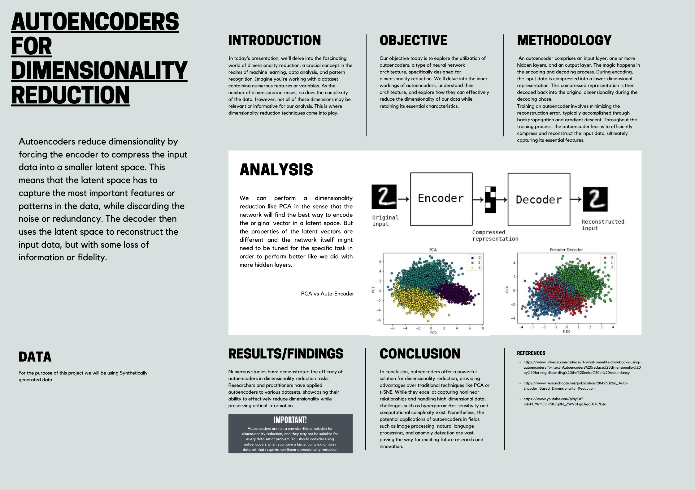

# Dimensionality Reduction with Autoencoders
Explore the power of autoencoders for dimensionality reduction tasks. This repository contains code implementation, datasets, and a detailed report showcasing the effectiveness of autoencoders in reducing the dimensionality of high-dimensional data while preserving essential information.

## Overview
This project explores the application of autoencoders, a type of artificial neural network, for dimensionality reduction tasks. Dimensionality reduction is a crucial preprocessing step in machine learning and data analysis, aimed at reducing the number of features or variables while retaining essential information. By transforming high-dimensional data into a lower-dimensional representation, dimensionality reduction methods enable efficient computation, visualization, and improved model performance.

## Project Components
- **Report**: 
- **Datasets**: 
- **Jupyter Notebook**: 

## Repository Contents
- [Report.pdf](link_to_report_pdf) - The detailed report of the project, including methodology, results, analysis, and conclusions
- [Dataset](link_to_datasets_folder) - The dataset files used in the project (CSV format)
- [Notebook.ipynb](link_to_notebook_ipynb) - The original Jupyter Notebook file containing the code implementation and analysis

## Getting Started
To replicate the project or explore the code, follow these steps:
1. Clone the repository to your local machine.
2. Navigate to the directory containing the Jupyter Notebook.
3. Open the Notebook using Jupyter or any compatible environment.
4. Run the code cells to execute the project and reproduce the results.

## License
This project is licensed under the [MIT License](LICENSE).

## Contributors
- Vishal Singh - [LinkedIn](https://www.linkedin.com/in/vishal-singh-326b97227/)
- Vedant Kumar - [LinkedIn]([link_to_vedant_linkedin](https://www.linkedin.com/in/vedant-kumar-2249b0254/ ))
- M. Aditya - [LinkedIn]([link_to_aditya_linkedin](https://www.linkedin.com/in/m-aditya-b56965238/))
